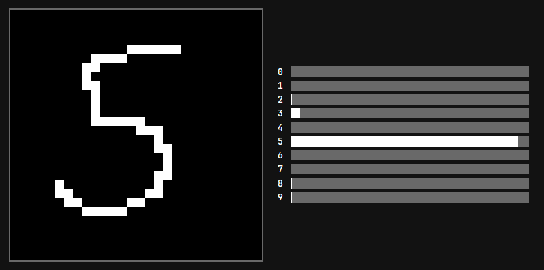

# Pure CSS MNIST

An MNIST demo that runs entirely in CSS.



### Architecture

```
Input (28×28 binary) → Conv2d(1→4, 5×5, stride=4) → LeakyReLU(0.01) → Linear(144→10) → Softmax
```

## Usage

### Install dependencies

```bash
uv sync
bun install
```

### Train the model

```bash
uv run main.py
```

This trains the network and generates `model.css`.

### Build the frontend

```bash
bun run index.tsx
```

Outputs static HTML to `dist/`.

## How Drawing Works

Drawing uses a clever CSS-only trick with `:has()` and custom properties.

Each pixel (0-783) corresponds to a custom property `--in-X`.

1. Default State:
   By default, all input variables have a massive transition delay, effectively "freezing" their state.
   ```css
   :root {
     /* Transition takes 1s but starts after 999,999s (approx 11.6 days) */
     transition: --in-0 1s 999999s, --in-1 1s 999999s, ...;
   }
   ```

2. Drawing State:
   When the mouse is down (`.cell:active`) and hovering over a specific pixel (`.cell-X:hover`), we set that specific variable to 1.

   We must explicitly define the transition list again. We set the current pixel's transition to `0s` (instant) while explicitly maintaining the long delay for all other pixels so they don't reset.

   ```css
   /* Example for pixel 0 */
   :root:has(.board > .cell:active):has(.board > .cell-0:hover) { 
     --in-0: 1; 
     /* --in-0 updates instantly, others keep their state */
     transition: --in-0 0s, --in-1 1s 999999s, --in-2 1s 999999s, ...; 
   }
   ```
